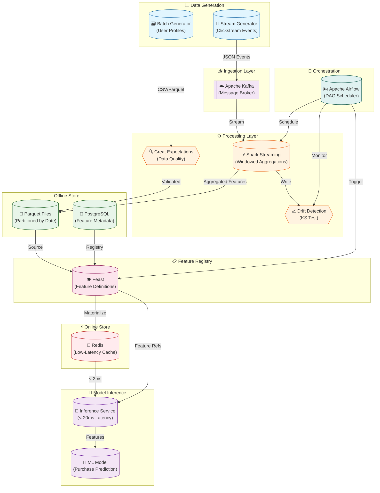
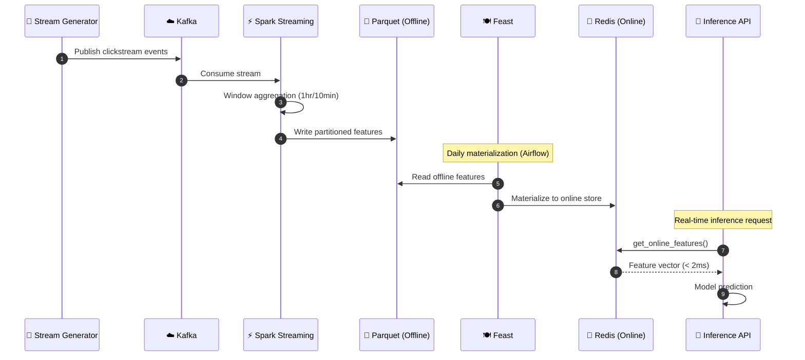

# 🏗️ ML Feature Store

A production-grade **Feature Store** platform built with **Feast**, **Kafka**, **Spark Streaming**, **Redis**, and **PostgreSQL**. This project demonstrates real-time ML feature engineering, from data ingestion to low-latency model inference.

[](https://www.python.org/)
[](https://feast.dev/)
[](https://kafka.apache.org/)
[](https://spark.apache.org/)
[](https://redis.io/)

---

## 📐 System Architecture



---

## 🔄 Data Flow Pipeline



---

## 🚀 Quick Start

### Prerequisites
- Docker & Docker Compose
- Python 3.11+ (Conda recommended)
- 8GB+ RAM

### 1. Start Infrastructure
```bash
cd "ML Feature Store"
docker compose up -d
```

### 2. Generate Mock Data
```bash
conda activate ml_global

# Generate 10K user profiles
python scripts/batch_generator.py

# Start streaming (Ctrl+C to stop)
python scripts/stream_generator.py --rate 10
```

### 3. Apply Feast Schema
```bash
cd feast_repo && feast apply
feast materialize-incremental $(date +%Y-%m-%dT%H:%M:%S)
```

### 4. Test Real-Time Inference
```bash
python scripts/inference_service.py --users user_000001 user_000010
```

---

## 📦 Project Structure

```
ML Feature Store/
├── docker-compose.yaml          # Infrastructure orchestration
├── Dockerfile.jupyter           # Custom Jupyter image
├── requirements.txt             # Python dependencies
│
├── scripts/
│   ├── batch_generator.py       # User profiles generator
│   ├── stream_generator.py      # Kafka event producer
│   ├── data_quality_checks.py   # Great Expectations validation
│   ├── drift_detection.py       # KS test drift monitoring
│   └── inference_service.py     # Real-time feature serving
│
├── spark/
│   └── apps/
│       └── clickstream_aggregation.py  # Structured Streaming job
│
├── feast_repo/
│   ├── feature_store.yaml       # Feast configuration
│   └── features.py              # Entity & Feature View definitions
│
├── airflow/
│   ├── dags/
│   │   └── feature_store_materialization.py
│   └── scripts/
│       └── validate_online_store.py
│
└── data/
    ├── user_profiles.csv        # Batch data
    ├── user_profiles.parquet    # Feast-compatible format
    └── offline_store/           # Spark output
```

---

## 🧩 Components

### 📊 Data Generators

| Script | Type | Output | Description |
|--------|------|--------|-------------|
| `batch_generator.py` | Batch | 10K users | Weighted distributions for tier, country, age |
| `stream_generator.py` | Stream | Kafka | Clickstream events at configurable rate |

### ⚙️ Processing

| Component | Technology | Function |
|-----------|------------|----------|
| Windowed Aggregation | PySpark | 1-hour windows, 10-min slide |
| Data Quality | Great Expectations | Schema validation, null checks |
| Drift Detection | SciPy KS Test | Distribution comparison |

### 💾 Storage

| Store | Technology | Latency | Use Case |
|-------|------------|---------|----------|
| Offline | Parquet | ~100ms | Training, Backfill |
| Online | Redis | < 2ms | Real-time inference |
| Registry | PostgreSQL | N/A | Feature metadata |

---

## 📈 Performance Benchmarks

### Online Feature Serving

| Metric | Value | Target |
|--------|-------|--------|
| **Average Latency** | 1.14ms | < 20ms ✅ |
| **P95 Latency** | 1.57ms | < 20ms ✅ |
| **Throughput** | ~1000 req/s | - |

### Data Quality Results

| Check | Status |
|-------|--------|
| Age not null | ✅ Pass |
| Age 18-120 | ✅ Pass |
| Valid subscription tier | ✅ Pass |
| User ID unique | ✅ Pass |

---

## 🛠️ Key Technologies

| Category | Technologies |
|----------|-------------|
| **Feature Store** | Feast 0.37 |
| **Streaming** | Kafka 7.5, Spark Structured Streaming 3.3 |
| **Storage** | Redis 7, PostgreSQL 15, Parquet |
| **Orchestration** | Apache Airflow 2.8 |
| **Data Quality** | Great Expectations, SciPy |
| **Containerization** | Docker Compose |

---

## 📚 Feature Definitions

### User Profile Features (Batch)
```python
user_profile_features = FeatureView(
    name="user_profile_features",
    entities=[user_entity],
    schema=[
        Field(name="age", dtype=Int64),
        Field(name="country", dtype=String),
        Field(name="subscription_tier", dtype=String),
        Field(name="activity_weight", dtype=Float64),
    ],
    ttl=timedelta(days=365),
)
```

### User Click Features (Streaming)
```python
user_click_features = FeatureView(
    name="user_click_features",
    schema=[
        Field(name="click_count", dtype=Int64),
        Field(name="view_count", dtype=Int64),
        Field(name="cart_rate", dtype=Float64),
        Field(name="conversion_rate", dtype=Float64),
    ],
    ttl=timedelta(hours=24),
)
```

---

## 🔍 Monitoring & Observability

### Drift Detection
```python
from scripts.drift_detection import analyze_click_count_drift

result = analyze_click_count_drift(
    yesterday_data=offline_df,
    today_data=online_df,
    feature_column="click_count_1h",
    p_threshold=0.05,
)

if result["is_drift_detected"]:
    alert("🚨 Distribution drift detected!")
```

---

## 🏆 Skills Demonstrated

- **Data Engineering**: Kafka, Spark Streaming, ETL pipelines
- **MLOps**: Feature stores, model serving, CI/CD
- **Distributed Systems**: Docker, microservices architecture
- **Real-Time ML**: Low-latency inference, online/offline stores
- **Data Quality**: Validation frameworks, drift detection

---

## 📄 License

MIT License - Feel free to use this project for learning and portfolio purposes.

---

<div align="center">
  <b>Built with ❤️ for ML Engineering</b>
</div>
>>>>>>> b59bf4f (Created repo and added config)
